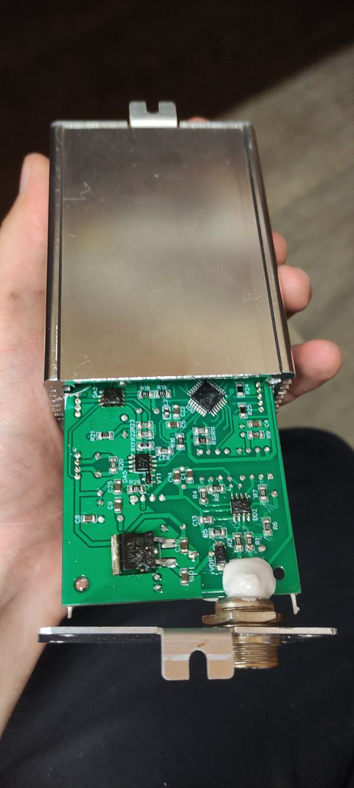
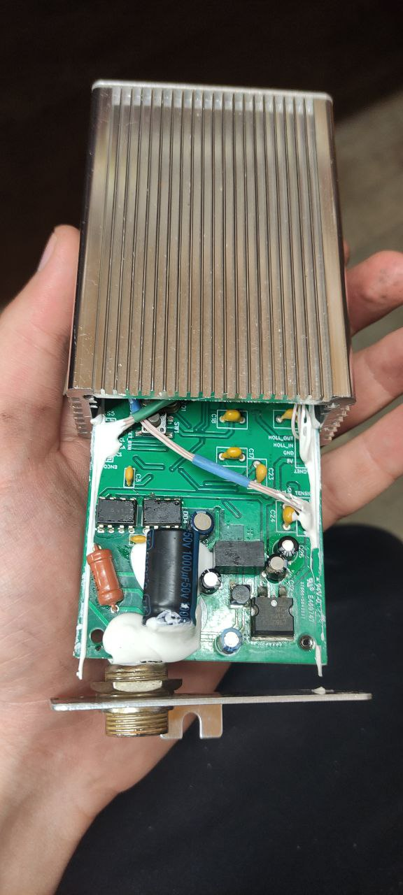
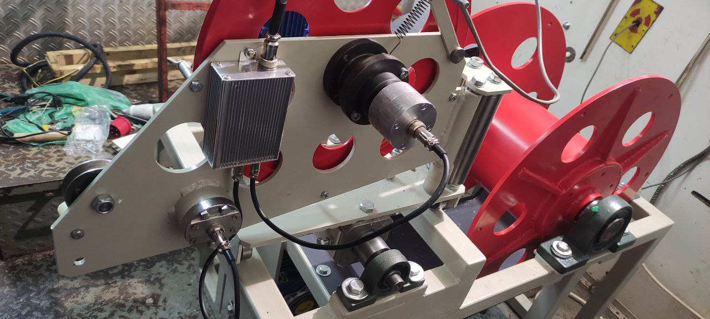
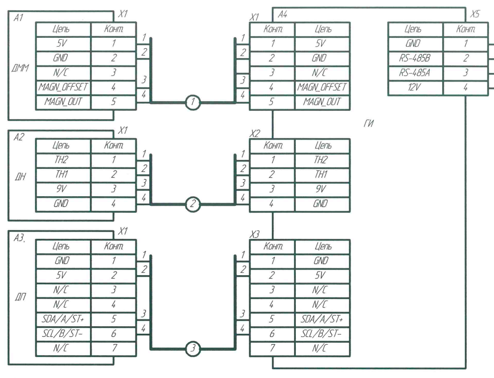

## Measurement Device for Carotage System

### 1. Review

- **Purpose:** Brief overview of the measurement device’s role within the carotage system.
- **MCU:** ATmega328
- **Revision:** `v1`
- **Software version:** `v0.1.1` 
- **Last Updated:** `27.07.2025`

### 2. Device

    
### 3. Application

### 4. Power & Interfaces

- **Power**
  - **Voltage Supply Range:** `8 – 24 V`
  - **Average Input Current:** `300 mA`
- **Interfaces**
  - **RS‑485** (isolated)
  - **Tension Sensor**
    *based on bridge scheme with diff. amp*
    - **DAC1:** `0.5 – 8 V`  
      *Offset control for tension sensor*
    - **ADC:** 10‑bit (internal ATmega328)
  - **Magnet Tag Sensor**
    *based on UGN3503 Holla sensor IC*  
    - **DAC2:** `2 – 3 V` reference  
      *Offset control for magnet tag sensor*
    - **GPIO:**  
      - High = no tag  
      - Low  = magnet tag
  - **Encoder**
    *optical or magnet variants*
    - Incremental AB
    - TWI
    - ST+ / ST−
### 5. Pinout

### References 
 - Hardware schemes:  https://oshwlab.com/emile102201/meansur_rs485_2024-05-19_16-24-03/ 